# ✍️ SmartHandwritingAI

Ứng dụng Android nhận diện chữ viết tay thông minh sử dụng **TensorFlow Lite** và **EMNIST Dataset** — hỗ trợ nhận dạng số (0–9) và chữ cái (A–Z), giải phép tính viết tay, đồng bộ dữ liệu qua **Firebase Storage & Firestore**, tích hợp **GitHub Actions CI/CD** và **Firebase ML (Model Downloader)**.

<p align="center">
  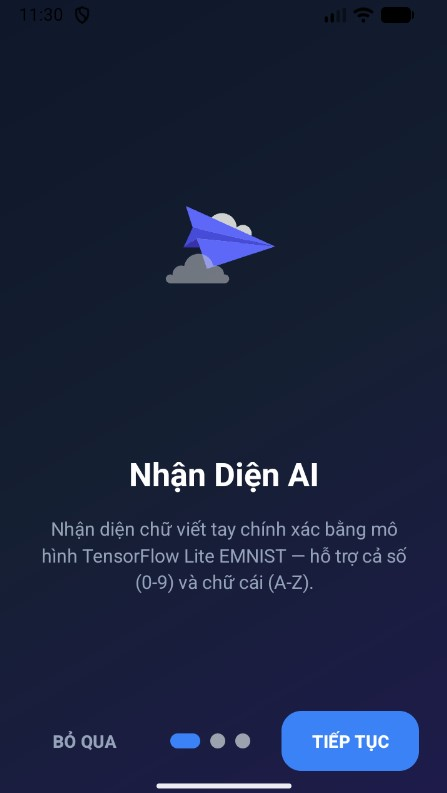
  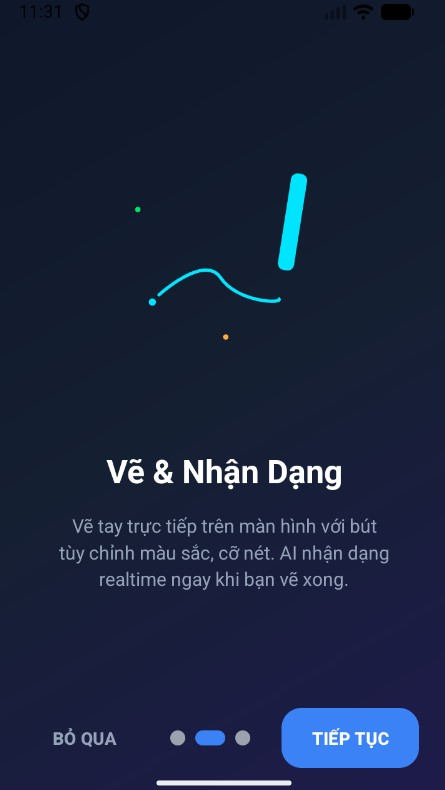
  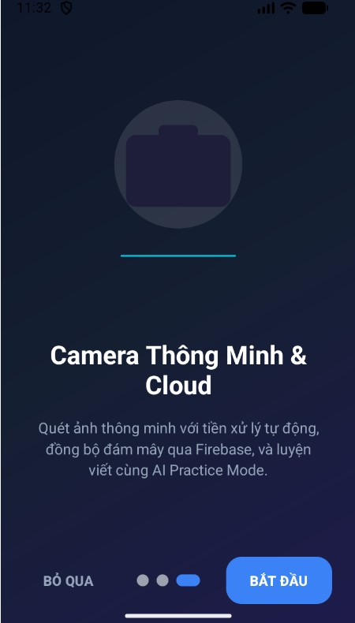
</p>

---

## 📖 Tổng Quan

**SmartHandwritingAI** là ứng dụng Android được xây dựng bằng Java, tích hợp mô hình AI (CNN) được huấn luyện trên dataset EMNIST để nhận dạng **36 ký tự** (0–9, A–Z) từ chữ viết tay. Ứng dụng hỗ trợ nhiều phương thức nhập liệu: vẽ tay trực tiếp, chụp ảnh từ camera, hoặc chọn ảnh từ thư viện.

### ✨ Điểm nổi bật (MLOps & AI DevOps)

- 🤖 **AI nhận dạng realtime** — Nhận diện ngay khi bạn vẽ xong (debounce 500ms).
- 🧮 **Giải toán AI** — Vẽ biểu thức toán học (bao gồm phân số lồng nhau), AI tự tính kết quả và tự sửa lỗi logic ngữ cảnh.
- 🔄 **Cập nhật mô hình từ xa (OTA)** — Tích hợp **Firebase ML Model Downloader** giúp cập nhật mô hình AI ngầm thời gian chạy không cần build lại app.
- 🚀 **Tự động hóa CI/CD** — Cấu hình **GitHub Actions** tự động chạy kiểm thử và build đóng gói APK cài đặt khi push code.
- 📸 **Camera thông minh** — Chụp ảnh + crop tự động với UCrop.
- 💾 **Room Database & Firebase Cloud** — Lưu trữ cục bộ bằng SQLite (Room) và đồng bộ đám mây bằng **Cloud Firestore** & **Firebase Storage**.
- 🔊 **Text-to-Speech** & **Dark Mode** — Đọc kết quả bằng giọng nói và tối ưu giao diện tối hiện đại.

---

## 📱 Ảnh Giao Diện

### Đăng Nhập & Đăng Ký

<table>
  <tr>
    <td align="center">
      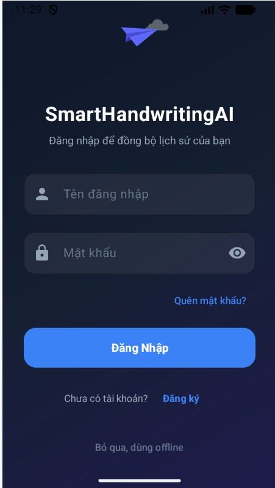<br>
      <b>Đăng Nhập</b>
    </td>
  </tr>
</table>

### Vẽ Tay & Nhận Dạng

<table>
  <tr>
    <td align="center">
      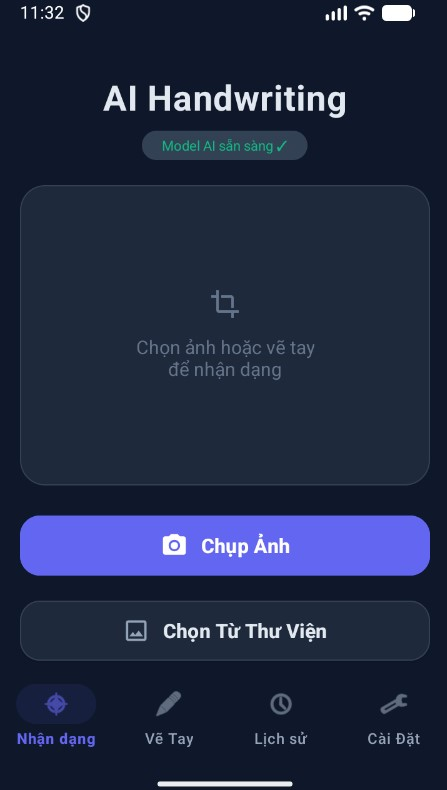<br>
      <b>Nhận Dạng (Tiếng Việt)</b>
    </td>
    <td align="center">
      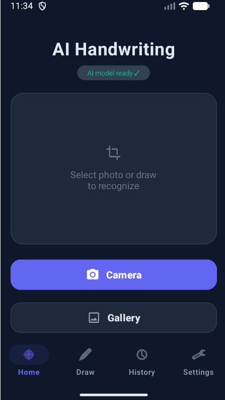<br>
      <b>Nhận Dạng (English)</b>
    </td>
  </tr>
  <tr>
    <td align="center">
      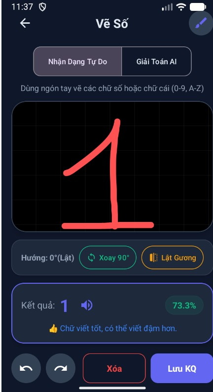<br>
      <b>Nhận Dạng Tự Do</b>
    </td>
    <td align="center">
      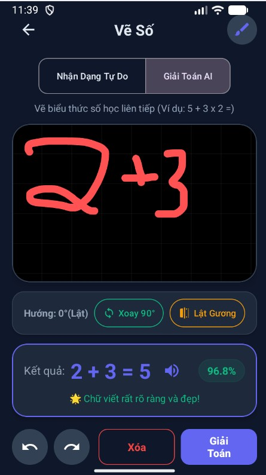<br>
      <b>Giải Toán AI</b>
    </td>
  </tr>
  <tr>
    <td align="center">
      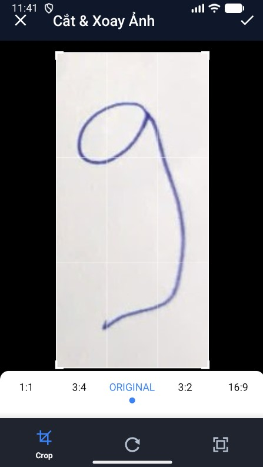<br>
      <b>Crop & Xoay Ảnh</b>
    </td>
    <td align="center">
      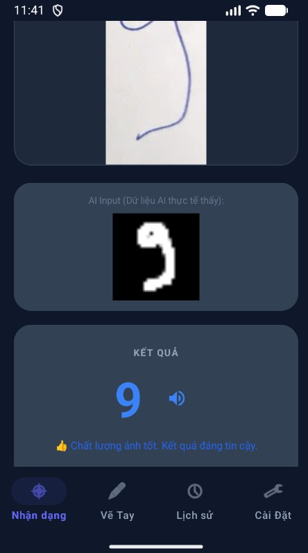<br>
      <b>Kết Quả Nhận Dạng</b>
    </td>
  </tr>
</table>

### Lịch Sử & Cài Đặt

<table>
  <tr>
    <td align="center">
      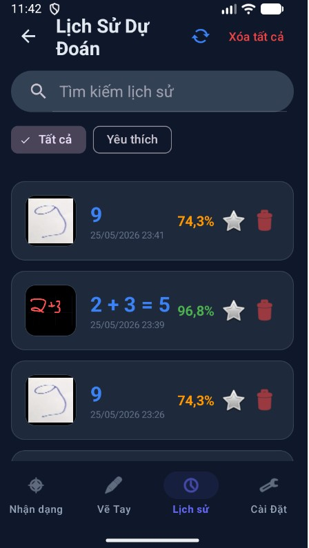<br>
      <b>Lịch Sử Dự Đoán</b>
    </td>
    <td align="center">
      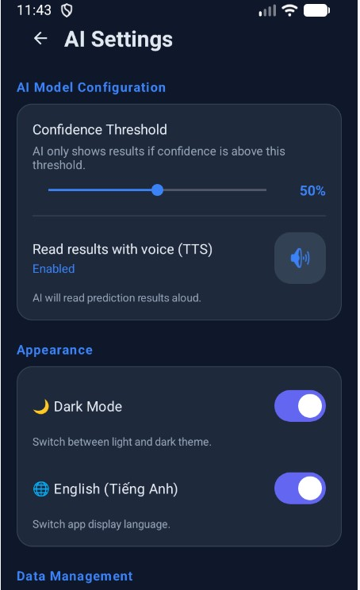<br>
      <b>Cài Đặt (English)</b>
    </td>
    <td align="center">
      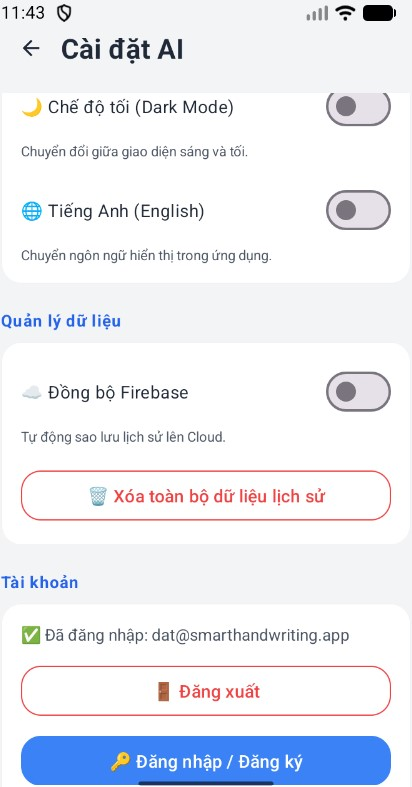<br>
      <b>Cài Đặt (Tiếng Việt)</b>
    </td>
  </tr>
</table>

---

## 🚀 Chức Năng Chi Tiết

### 1. 🏠 Trang Chủ — Nhận Dạng Từ Ảnh
- Chụp ảnh trực tiếp từ **Camera** hoặc chọn ảnh từ **Thư Viện**.
- Crop & xoay ảnh tự động bằng **UCrop**.
- Hiển thị ảnh gốc đã crop & **AI Input** (ảnh 28×28px mà model nhìn thấy).
- Hiển thị kết quả nhận dạng + **Top 3 dự đoán** kèm biểu đồ trực quan (**MPAndroidChart**).

### 2. ✏️ Vẽ Tay — DrawActivity
- Canvas vẽ tay với tùy chỉnh **màu sắc** và **cỡ nét** bút kèm Undo/Redo.
- Hai chế độ:
  - **Nhận Dạng Tự Do** — Vẽ từng ký tự, AI nhận diện realtime (debounce 500ms).
  - **Giải Toán AI** — Vẽ biểu thức, tự phân tách nét bằng BFS, giải toán phân số lồng nhau và tự sửa lỗi logic ngữ cảnh AI (<80% confidence).

### 3. 📋 Lịch Sử — HistoryActivity
- Lưu offline bằng Room DB, hỗ trợ tìm kiếm, đánh dấu yêu thích và vuốt ngang (swipe) để xóa.
- Đồng bộ dữ liệu lên Firebase (**Cloud Storage** cho ảnh và **Cloud Firestore** cho text/metadata).

### 4. ⚙️ Cài Đặt — SettingsActivity
- Điều chỉnh ngưỡng confidence (0–100%).
- Bật/tắt đọc kết quả giọng nói (TTS), Dark Mode và cấu hình ngôn ngữ (Anh/Việt).

---

## 🧠 Quy Trình Huấn Luyện & Mô Hình AI

### Kiến Trúc CNN
Mô hình được huấn luyện trên **EMNIST Dataset** (digits + letters) với kiến trúc CNN:
```
Input (28×28×1)
   ↓
Conv2D(32) → BatchNorm → Conv2D(32) → BatchNorm → MaxPool → Dropout(0.25)
   ↓
Conv2D(64) → BatchNorm → Conv2D(64) → BatchNorm → MaxPool → Dropout(0.25)
   ↓
Conv2D(128) → BatchNorm → Conv2D(128) → BatchNorm → GlobalAvgPool → Dropout(0.35)
   ↓
Dense(256) → BatchNorm → Dropout(0.5)
   ↓
Dense(36, softmax) → Output
```

### So Sánh Hiệu Năng Thực Nghiệm (Float32 vs. Float16 Quantized)

#### 1. Mô hình EMNIST (36 lớp chữ + số)
* **Kích thước mô hình:** Giảm từ **3.2 MB** (Float32) xuống còn **~655 KB** (Float16) ➡️ **Tiết kiệm 80% dung lượng**.
* **Độ trễ suy luận (Latency):** Giảm xuống còn **~18 ms** trên thiết bị di động, phản hồi thời gian thực.
* **Độ chính xác (Accuracy):** Duy trì ở mức **86.22%** (chỉ giảm cực nhỏ ~0.32% so với Float32).

---

## 🏗️ Sơ Đồ Kiến Trúc Hệ Thống

```
┌────────────────────────────────────────────────────────┐
┌─────────────────────────────────────────────────────┐  │
│                   SmartHandwritingAI                 │  │
├─────────────────────────────────────────────────────┤  │
│                                                     │  │
│  ┌──────────┐  ┌───────────┐  ┌──────────────────┐  │  │
│  │  Camera  │  │  Gallery  │  │  Drawing Canvas  │  │  │
│  └────┬─────┘  └─────┬─────┘  └────────┬─────────┘  │  │
│       │              │                  │            │  │
│       └──────────┬───┘                  │            │  │
│                  ▼                      ▼            │  │
│         ┌──────────────┐      ┌─────────────────┐   │  │
│         │  UCrop       │      │  DrawingView    │   │  │
│         │  (Crop/Rotate│      │  (Canvas)       │   │  │
│         └──────┬───────┘      └────────┬────────┘   │  │
│                │                       │            │  │
│                └───────────┬───────────┘            │  │
│                            ▼                        │  │
│                  ┌──────────────────┐               │  │
│                  │ ImageProcessor   │               │  │
│                  │ (Preprocessing)  │               │  │
│                  └────────┬─────────┘               │  │
│                           ▼                         │  │
│                  ┌──────────────────┐               │  │
│                  │ DigitClassifier  │               │  │
│                  │ (TFLite Model)   │               │  │
│                  └────────┬─────────┘               │  │
│                           ▼                         │  │
│              ┌────────────┴─────────────┐           │  │
│              ▼                          ▼           │  │
│    ┌──────────────────┐     ┌────────────────────┐  │  │
│    │  MathParser      │     │  OperatorDetector  │  │  │
│    │  FractionParser  │     │  (Math Mode)       │  │  │
│    └──────────────────┘     └────────────────────┘  │  │
│                                                     │  │
│  ┌─────────────────────────────────────────────────┐│  │
│  │                Data & MLOps Layer               ││  │
│  │  ┌──────────────┐    ┌───────────────────────┐  ││  │
│  │  │ Room Database │    │ Firebase Cloud Storage│  ││  │
│  │  │ (Offline)     │◄──►│ & Cloud Firestore     │  ││  │
│  │  └──────────────┘    └───────────────────────┘  ││  │
│  │                      ┌───────────────────────┐  ││  │
│  │                      │ Firebase ML           │  ││  │
│  │                      │ (Model Downloader)    │  ││  │
│  │                      └───────────────────────┘  ││  │
│  └─────────────────────────────────────────────────┘│  │
└─────────────────────────────────────────────────────┘  │
└────────────────────────────────────────────────────────┘
```

---

## 🛠️ Công Nghệ Sử Dụng

| Công nghệ | Mục đích |
|---|---|
| **Java (JDK 11)** | Ngôn ngữ chính phát triển Android App |
| **TensorFlow Lite** | Inference mô hình AI offline trên thiết bị |
| **Firebase ML Downloader** | Cập nhật mô hình AI động từ xa (OTA) |
| **GitHub Actions** | Xây dựng pipeline tích hợp liên tục CI/CD |
| **Cloud Firestore** | Lưu trữ metadata lịch sử đồng bộ đám mây |
| **Firebase Storage** | Lưu trữ tệp hình ảnh nét vẽ đám mây |
| **Firebase Auth** | Xác thực đăng nhập & đăng ký người dùng |
| **Room Database** | Lưu trữ lịch sử offline cục bộ |
| **UCrop** | Crop & xoay ảnh trước khi nhận dạng |
| **MPAndroidChart** | Biểu đồ Top 3 predictions |
| **Lottie Animation** | Hoạt ảnh Onboarding & Splash |
| **Material Design 3** | Giao diện hiện đại với Dark Mode |

---

## 📂 Cấu Trúc Dự Án

```
SmartHandwritingAI/
├── .github/
│   └── workflows/
│       └── android_ci.yml                   # Cấu hình GitHub Actions CI/CD
├── app/
│   ├── src/main/
│   │   ├── java/dat/nguyenvan/smarthandwritingai/
│   │   │   ├── SplashActivity.java          # Splash screen
│   │   │   ├── OnboardingActivity.java      # Giới thiệu lần đầu
│   │   │   ├── LoginActivity.java           # Đăng nhập / Đăng ký
│   │   │   ├── MainActivity.java            # Trang chủ (Camera/Gallery)
│   │   │   ├── DrawActivity.java            # Vẽ tay & Giải toán
│   │   │   ├── HistoryActivity.java         # Lịch sử dự đoán
│   │   │   ├── SettingsActivity.java        # Cài đặt ứng dụng
│   │   │   ├── DigitClassifier.java         # TFLite model inference & Firebase ML Downloader
│   │   │   ├── ImageProcessor.java          # Tiền xử lý ảnh cho AI
│   │   │   ├── DrawingView.java             # Custom View canvas vẽ tay
│   │   │   ├── MathParser.java              # Parser biểu thức toán học
│   │   │   ├── OperatorDetector.java        # Phát hiện toán tử (+, -, ×, ÷, =)
│   │   │   ├── FractionParser.java          # Xử lý phân số
│   │   │   ├── FirebaseSyncHelper.java      # Đồng bộ Firebase Storage & Firestore
│   │   │   ├── AppDatabase.java             # Room Database config
│   │   │   ├── PredictionEntity.java        # Entity lịch sử dự đoán
│   │   │   ├── PredictionDao.java           # Data Access Object
│   │   │   ├── HistoryAdapter.java          # RecyclerView adapter
│   │   │   ├── OnboardingAdapter.java       # ViewPager adapter
│   │   │   └── UIUtils.java                 # Utility functions
│   │   ├── assets/
│   │   │   └── model.tflite                 # Mô hình AI mặc định (~655 KB)
```

---

## ⚡ Cài Đặt & Chạy

### Yêu Cầu
- **Android Studio** Ladybug (2024.2) trở lên
- **JDK 11+**
- **Android SDK 36**
- Tài khoản **Firebase**

### Bước 1: Clone Repository
```bash
git clone https://github.com/jtadd123/android-handwriting-number-recognition.git
```

### Bước 2: Cấu hình Firebase
1. Tạo project trên [Firebase Console](https://console.firebase.google.com/)
2. Tải file `google-services.json` đặt vào thư mục `app/`
3. Kích hoạt **Authentication**, **Cloud Firestore** và **Firebase Storage**
4. Trong mục **AI services > Machine Learning**, chọn tab **Custom**, tạo mô hình mới tên là **`HandwritingModel`** và upload file `model.tflite` của bạn lên ở trạng thái **Published**.

### Bước 3: Build & Run
1. Mở thư mục `SmartHandwritingAI` bằng **Android Studio**
2. Đợi Gradle Sync và chạy app qua nút ▶️ **Run**.

---

## 👨‍💻 Tác Giả

**Nguyễn Văn Đạt** - MSSV: 65130430  
GVHD: Mai Cường Thọ
